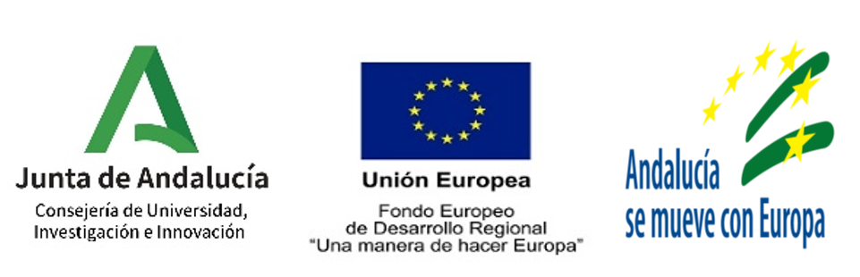

Principal investigators: Eduardo Ros Vidal and Jesús Garrido Alcázar.

CEREBIO sits at the intersection of Computational Neuroscience and Neurorobotics. These fields seek to understand the principles that underlie nervous-system function and neurological disorders, while developing new computational architectures, machine-learning systems, robot-control strategies, and AI applications.

The principles that allow the brain to manage highly multimodal and multidimensional information are still largely unknown. The brain must not be considered in isolation from the body: its evolution and continuous adaptation are guided by sensorimotor integration in a dynamic environment. CEREBIO therefore studies neural systems as they operate in concrete behavioural tasks.

The project adopts a novel neural-centre modelling methodology. It studies neural subsystems embedded in motor-control tasks by integrating the neural system with the body it controls and with body–environment interaction.

